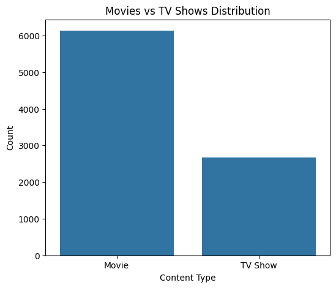
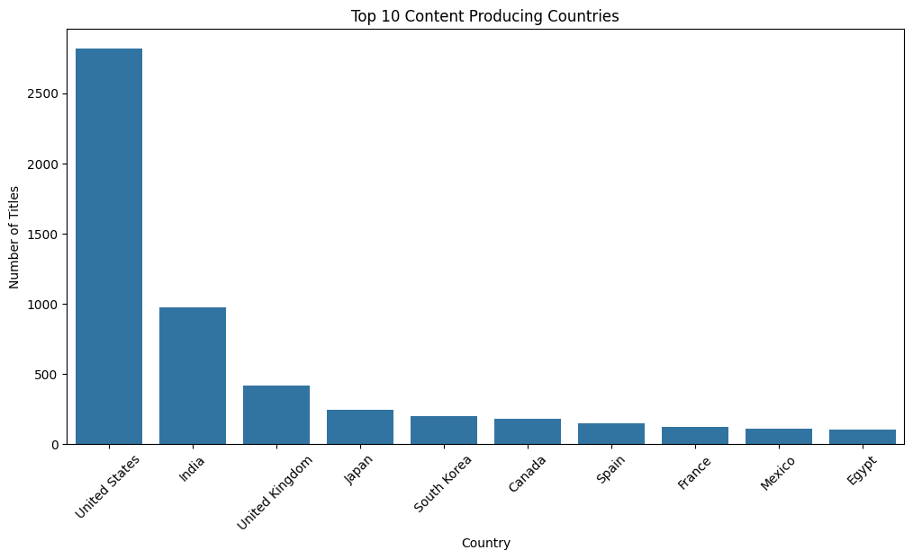
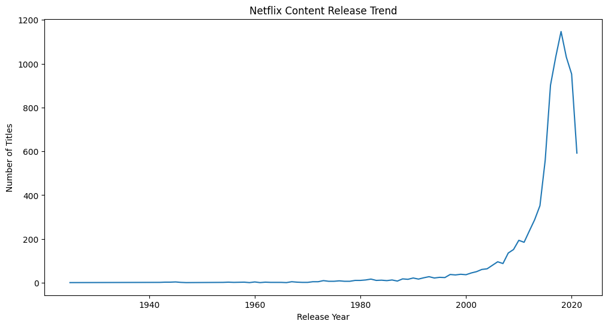
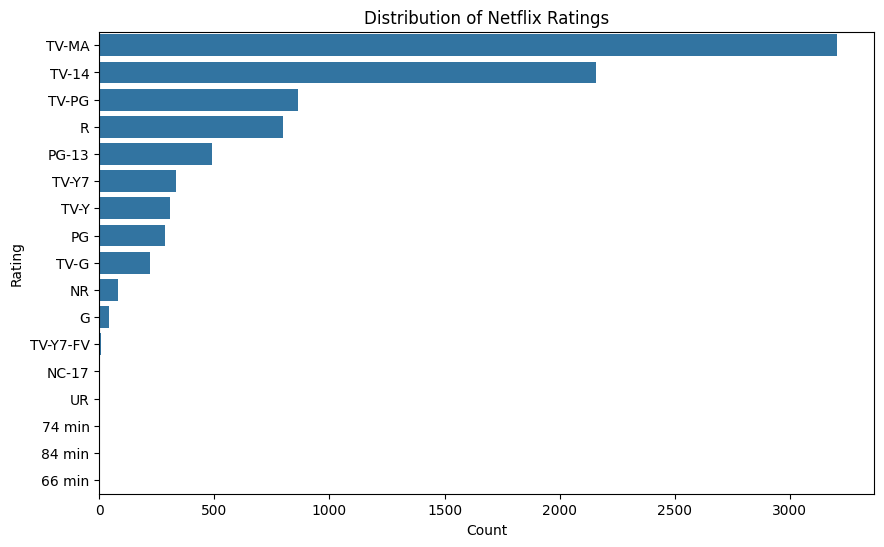
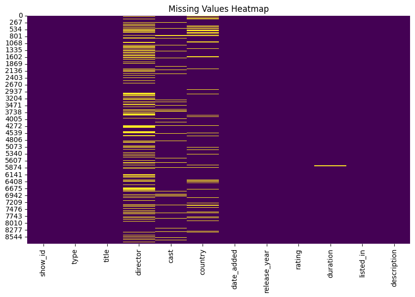

# Netflix Movies & TV Shows - Exploratory Data Analysis (EDA)

## Project Overview

This project performs Exploratory Data Analysis (EDA) on the Netflix Movies and TV Shows dataset. The analysis focuses on identifying patterns, trends, and insights related to Netflix content using statistical summaries and visualizations.

The project explores:
- Distribution of Movies and TV Shows
- Country-wise content production
- Release year trends
- Netflix ratings distribution
- Missing value analysis
- Content growth patterns

---

## Technologies Used

- Python
- Pandas
- NumPy
- Matplotlib
- Seaborn
- Google Colab

---

## Project Workflow

1. Import Libraries
2. Load Dataset
3. Explore Dataset
4. Data Cleaning
5. Missing Value Analysis
6. Statistical Analysis
7. Data Visualization
8. Insights & Findings
9. Conclusion

---

## Dataset Information

- Total Rows: 8807
- Total Columns: 12

Important columns:
- type
- title
- director
- country
- release_year
- rating
- duration
- listed_in

---

## Key Insights

- Movies dominate Netflix content compared to TV Shows.
- The United States contributes the highest amount of Netflix content.
- Netflix content releases increased significantly after 2015.
- TV-MA is the most common Netflix rating.
- Missing values are mainly present in `director`, `cast`, and `country` columns.

---

## Visualizations

### Movies vs TV Shows Distribution

---

### Top Content Producing Countries

---

### Netflix Content Release Trend

---

### Ratings Distribution

---

### Missing Values Heatmap

---

## Project Files

- `Netflix_EDA_Project.ipynb`
- `netflix_eda_project.py`
- `netflix_titles.csv`

---

## Conclusion

This EDA project successfully analyzed Netflix Movies and TV Shows data to uncover meaningful insights and trends. Various visualizations and statistical techniques were used to understand content distribution, ratings, release patterns, and missing data. The project demonstrates the importance of Exploratory Data Analysis in understanding real-world datasets and generating business insights.
